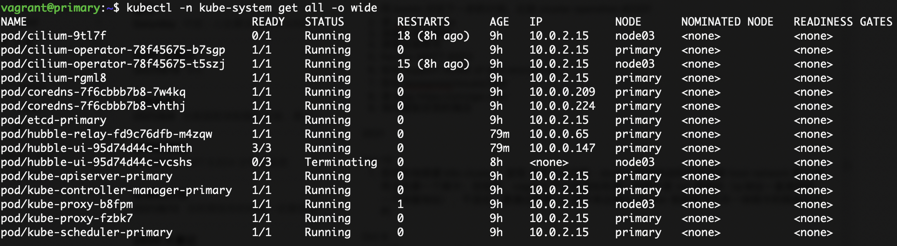

最近在本地尝试[Kubernetes 集群的搭建](https://github.com/nevill/learn-k8s)。

一个主机有两张网卡，在安装完集群以后，发现 Pod 里分配的 IP 全部都是主机第一张网卡的 IP。
而这个环境是 Vagrant + Virtualbox 安装，第一张网卡的 IP 地址也都是固定的。

开始找解决方案。

1. 想到 Pod 的网络是通过 cni 来分配的，也许可以通过改 cni 配置来实现。翻看了半天 cni 的资料，尝试了一下没有成功，以后要加强 cni 的学习。

2. 回头看这个图的时候，忽然发现有些 Pod 是能成功分配 IP 的，而那些分配到了相同 IP 的 Pod 在 Spec 定义里都有一个 `hostNetwork: true`。 确实，`10.0.2.15` 这个 IP 就是主机第一张网卡上的。翻看 k8s 源代码，发现有 hostNetwork 属性的 Pod 在确定其 IP 时，就是读取所在 node 上的 IP 地址 [1]。

3. Node 节点的信息都由 Kubelet 控制，因此，怎么取 node IP 的过程跟 cni 没关系，而是直接从 Spec 中读取。
而 Spec 中 status.address 是从主机上按照网卡顺序取 IP，或者，通过 --node-ip 这个参数指定。

4. 所以最终的解决方法就是在 kubelet 启动的参数中指定 node-ip 这个参数即可。

5. 这么做也有问题，比如这个 IP 地址是动态分配的怎么办？看到有 Issue 讨论 AWS 可以通过 API 解析域名的方式来获取 IP，这些功能是跟厂商绑定的了。

## 参考

[1] pkg/kubelet/kubelet_pods.go : `func (kl *Kubelet) generateAPIPodStatus(pod *v1.Pod, podStatus *kubecontainer.PodStatus) v1.PodStatus`
